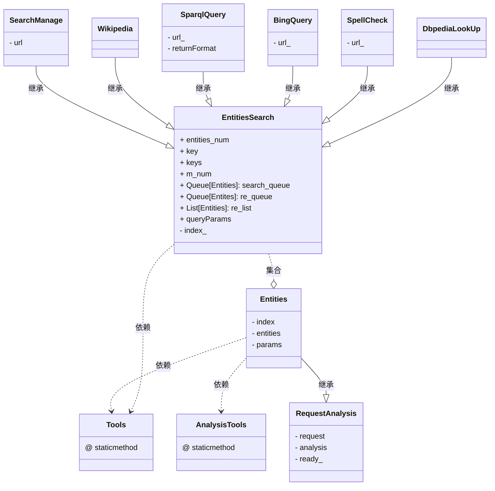

- **author  : Shuxin_Wang**
- **email   : 213202122@seu.edu.cn**
- **time    : 2022/6/2**
- **version: 0.4.6**


# 版本说明

## V0.1

- 简单查询，只有`SearchManage`一个查询类，单线程查询，简单解析；

## V0.2

- 新增`Entities`,`EntitiesSearch`基本类，`Tools.py`提供功能函数接口;
- 支持多线程查询;
- 支持N维列表数据输入；

## V0.3

- 新增解析工具函数，解析类;
- **（key='ids'时）支持正则表达目标解析，支持自定义解析函数的接口**；
- 支持wikidata数据模型中7种**值类型**数据的解析；
- 重新规划文件位置，类`SearchManage`作为类`EntitiesSearch`的子类
- 修复线程数过大导致的错误；

## V0.3.5

- 新增`Wikipedia`类，可实现`wikipedia.suggest(query)`的多线程调用；
- 解析claims下的具体值时，**每个值的基本格式为元组**，元组基本结构形如 (`值类型`，`主值1`, ···)；
- 修复大量bug，提高稳定性；

## V0.4

- 新增类`SparqlQuery`可进行自定义多线程*SPARQL*查询；
- 新增类`BingQuery`多线程爬取模糊搜索结果
- 工具函数作为工具**类下的静态方法**；
- 类`Entities`继承类`JsonAnalysis`，类`Wikipedia`继承类`EntitiesSearch`；
- 引入**<u>线程池`<concurrent.futures.ThreadPoolExecutor>`</u>代替基本线程事务**，进一步提高性能；

## v0.4.1

- 新增`SpellCheck`进行多线程爬取拼写纠错结果；
- 完成底层接口的注释；

## v0.4.5

- 重新整理文件目录和模块结构；
- 完成全英注释；

## v0.4.6

- 新增类`DbpediaLookUp`针对DBpedia知识图谱的多线程查询；
- 修改部分bug；


# 模块视图





# Quickstart


## \<SearchManage>

### 导入与初始化

```python
from searchmanage_Wiki import SearchManage

search_m1 = SearchManage(key='search', m_num=20)
search_m2 = SearchManage(key='ids', m_num=10)
"""
url_api(str): 查询网址，默认为"https://www.wikidata.org/w/api.php";
key(str): 查询action,'search'或者'ids';
m_num(int): 指定线程数目;
"""
```

### 重要方法说明

```python
    def search_run(self, points: list, keys: Union[str, List[str]] = None,
                   timeout: float = 30.0, time_stop: float = 30.0, block_num: int = 10,
                   function_=None, args: tuple = None, **kwargs) -> dict
```

- 输入N维文本或ID列表，多线程查询并根据解析关键词返回解析结果
- 参数说明
  - `points(list)`：N维文本或ID列表；
  - `keys(Union[str, List[str]])`：解析关键词或其列表；
  - `timeout(float)`：每个线程查询的最大限制时间，到超过这个时间，会视为查询失败，默认为`30.0`；
  - `time_stop(float)`：当某个线程查询失败时，会进行重新查询，该参数表示进行重新查询的间隔时间，默认为`30.0`；
  - `block_num(int)`：查询失败进行重新查询的最大次数，当达到最大次数时，返回`RunTimeError`异常，默认`10`；
  - `function_(function)`：自定义解析函数；函数要求：第一个参数为待解析`json`数据；当值为`None`时，使用默认解析方法，默认为`None`；
  - `args(tuple)`：自定义解析函数的**除第一个参数的其他参数元组**，默认为`None`；
  - `**kwargs`：可以**用来修改查询参数字典中的值**，比如我们要修改返回值数量('limit')为20，可以直接将`limit = 20`作为**函数参数**，修改其他查询参数同理；
- 返回`(dict)`
  - 解析关键词为键值，对应值为**对应位置映射**的解析结果；

### 解析关键词规范

1. labels,descriptions,aliases

   以`labels`为例子

   - `labels`,`labels/`,`labels//`→labels下字典
   - `labels/xx`→`xx`语言下的值

2. claims

   - `claims`,`claims/`,`claims//`→claims下字典
   - `claims/P`,`claims/P/`,`claims/P//`→属性ID列表
   - `claims/P/value`→所有属性下的值，**值的格式为元组**，(`值类型`，`主值1`, ···)
   - `claims/Pxx`,`claims/Pxx/`,`claims/Pxx//`→`Pxx`下的字典
   - `claims/Pxx/value`→`Pxx`的具体值，**值的格式为元组**，(`值类型`，`主值1`, ···)
   - `claims/Pxx/qualifiers-order`→`Pxx`限定词顺序列表
   - `claims/Pxx/qualifiers`,`claims/Pxx/qualifiers/`,`claims/Pxx/qualifiers//`→`Pxx`限定词下字典
   - `claims/Pxx/references`,`claims/Pxx/references/`,`claims/Pxx/references//`→`Pxx`引用下字典

3. sitelinks

   - `sitelinks`,`sitelinks/`,`sitelinks//`→外部链接下的字典

### 查询参数字典

```python
# key = 'search'
{
    'search': # 文本,
    'action': 'wbsearchentities',
    'format': 'json',
    'language': 'en',
    'type': 'item',
    'limit': 10,
    'strictlanguage': None,
    'continue': None,
    'props': None
}

# key = 'ids'
{
    'ids': # 实体ID,
    'action': 'wbgetentities',
    'format': 'json',
    'languages': 'en',
    'redirects': None,
    'sites': None,
    'title': None,
    'props': None,
    'languagefallback': None,
    'normalize': None,
    'sitefilter': None
}
```


## \<Wikipedia>

- 需要安装库`wikipedia` -->`pip install wikipedia`

### 导入与初始化

```python
from searchmanage_Wiki import Wikipedia
 
w1 = Wikipedia(m_num = 10)
"""
m_num(int):指定运行线程数量
"""
```

- 运行前请检查一下能否打开网址[https://en.wikipedia.org/w/api.php](https://en.wikipedia.org/w/api.php)，如果不能打开，请先检查网络。


### 重要方法说明

```python
    def search_run(self, points: list, time_stop: float = 30.0, block_num: int = 10,
                   function_=None, args: tuple = None, **kwargs) -> list
```

- 输入N维字符列表多线程调用`wikipedia`中相关函数，默认为函数`wikipedia.suggest()`
- 参数说明：
  - `points(list)`：待查询的**N维**字符列表；
  - `time_stop(float)`：当某个线程查询失败时，会进行重新查询，该参数表示进行重新查询的间隔时间，默认`30.0`；
  - `block_num(int)`：查询失败进行重新查询的最大次数，当达到最大次数时，返回`RunTimeError`异常，默认`10`；
  - `function(function)`：多线程调用`wikipedia`中的**<u>相关函数</u>**，默认为函数`wikipedia.suggest`，默认值为`None`；
  - `args(tuple)`：调用相关函数的**除第一个参数的其他参数元组**，默认为`None`；
  - `**kwargs`：用于功能拓展，暂无实际功能；
- 返回`(list)`：
  - 对应位置映射的结果列表


## \<SparqlQuery>

- 需要安装库`SPARQLWrapper`--->`pip install sparqlwrapper`

### 导入与初始化

```python
from searchmanage_Wiki import SparqlQuery

sql = SparqlQuery(m_num = 10, format_ = 'json')
"""
m_num(int):指定运行线程数量;
format_(str):查询返回格式，默认为'json';
url_(str):查询域名节点，默认为<SparqlQuery.URL_ = "https://query.wikidata.org/sparql">;
sparql_(str): 查询sparql格式语句，默认为<SparqlQuery.SPARQL_>;
"""
```


### 重要方法说明

```python
def search_run(self, points: list, timeout: float = 30.0, time_stop: float = 30.0,
                   block_num: int = 10, function_=None, args: tuple = None, **kwargs) -> dict
```

- 输入N维ID列表，返回结果字典；

- 参数说明
  - `points(list)`：N维ID列表；
  - `timeout(float)`：每个线程查询的最大限制时间，到超过这个时间，会视为查询失败，默认为`30.0`；
  - `time_stop(float)`：当某个线程查询失败时，会进行重新查询，该参数表示进行重新查询的间隔时间，默认为`30.0`；
  - `block_num(int)`：查询失败进行重新查询的最大次数，当达到最大次数时，返回`RunTimeError`异常，默认`10`；
  - `function_(function)`：自定义解析函数；函数要求：第一个参数为待解析`json`数据；当值为`None`时，使用默认解析方法，默认为`None`；
  - `args(tuple)`：自定义解析函数的**除第一个参数的其他参数元组**，默认为`None`；
  - `**kwargs`：用于功能拓展，暂时无实际功能；
- 返回`(dict)`
  - 解析关键词为键值，对应值为**对应位置映射**的解析结果；


### Sparql语句格式化

- 符合Sparql语句基本格式；
- 带查询变量位置使用`python`字符串格式化`%s`标识；
- 目前**只支持*<u>一个</u>***查询变量；

```python
# 默认sparql_
SparqlQuery.SPARQL_ = """
SELECT ?item ?itemLabel 
WHERE 
{
?item wdt:P31 wd:%s.
SERVICE wikibase:label { bd:serviceParam wikibase:language "[AUTO_LANGUAGE],en". }
}
```


## \<BingQuery>

### 导入与初始化

```python
from searchmanage_Wiki import BingQuery

b = BingQuery(m_num = 10)
"""
url_(str): 模糊搜索域名节点，默认为<BingQuery.URL_ = "https://www.bing.com/search">;
m_num(int):指定运行线程数量;
"""
```

### 重要方法说明

```python
def search_run(self, points: list, timeout: float = 30.0, time_stop: float = 30.0,
                   block_num: int = 10, function_=None, args: tuple = None, **kwargs) -> list
```

- 输入N维字符列表，输出模糊结果的`url`网址
- 参数说明
  - `points(list)`：N维字符列表；
  - `timeout(float)`：每个线程查询的最大限制时间，到超过这个时间，会视为查询失败，默认为`30.0`；
  - `time_stop(float)`：当某个线程查询失败时，会进行重新查询，该参数表示进行重新查询的间隔时间，默认为`30.0`；
  - `block_num(int)`：查询失败进行重新查询的最大次数，当达到最大次数时，返回`RunTimeError`异常，默认`10`；
  - `function_(function)`：自定义**正则解析**函数；函数要求：第一个参数为**待正则解析*<u>字符串</u>***；当值为`None`时，使用默认正则解析方法`<REG_ = r"https://www.wikidata.org/wiki/Q\d+"`，默认值为`None`；
  - `args(tuple)`：自定义解析函数的**除第一个参数的其他参数元组**，默认为`None`；
  - `**kwargs`：用于功能拓展，暂时无实际功能；
- 返回`(list)`
  - 模糊搜索结果的`url`网址映射列表


## \<SpellCheck>

### 导入初始化

```python
from searchmanage_Wiki import SpellCheck

sc = SpellCheck(m_num = 10)
"""
url_(str): 爬取拼写结果的域名节点，默认为<BingQuery.URL_ = "https://www.bing.com/search">;
m_num(int):指定运行线程数量;
"""
```

### 重要方法说明

```python
def search_run(self, points: list, timeout: float = 30.0, time_stop: float = 30.0,
                   block_num: int = 10, function_=None, args: tuple = None, **kwargs) -> list
```

- 输入N维字符列表，输出纠错后结果
- 参数说明
  - `points(list)`：N维字符列表；
  - `timeout(float)`：每个线程查询的最大限制时间，到超过这个时间，会视为查询失败，默认为`30.0`；
  - `time_stop(float)`：当某个线程查询失败时，会进行重新查询，该参数表示进行重新查询的间隔时间，默认为`30.0`；
  - `block_num(int)`：查询失败进行重新查询的最大次数，当达到最大次数时，返回`RunTimeError`异常，默认`10`；
  - `function_(function)`：自定义解析函数；函数要求：第一个参数为`requests`对象的`text`属性；当值为`None`时，获取网页搜索推荐纠错结果，默认值为`None`；
  - `args(tuple)`：自定义解析函数的**除第一个参数的其他参数元组**，默认为`None`；
  - `**kwargs`：用于功能拓展，暂时无实际功能；
- 返回`(list)`
  - 单词纠错结果映射列表


## \<DbpediaLookUp>

### 导入初始化

```python
from searchmanage_Wiki import DbpediaLookup

db = DbpediaLookUp(m_num=10)
"""
key(str):
	针对实体某部分进行搜索，可选"query","label", "comment" 
	or "category", 默认为全局搜索"query";
m_num(int):指定运行线程数量;
"""
```

### 重要方法说明

```python
def search_run(self, points: list, patten: str = "search", is_all: bool = False, timeout: float = 30.0,
                   time_stop: float = 30.0, block_num: int = 10, function_=None, args: tuple = (), **kwargs) -> dict
```

- 输入N维文本列表，多线程查询并根据解析关键词返回解析结果
- 参数说明
  - `points(list)`：N维文本列表；
  - `patten(str)`：查询模式，可选`'search'`或`'prefix'`，其中`'prefix'`为前缀搜索，对应URL为`"https://lookup.dbpedia.org/api/prefix"`，默认为普通搜索为`'search'`，对应URL为`"https://lookup.dbpedia.org/api/search"`；
  - `is_all(bool)`：是否返回所有解析结果，解析键值见[查询参数字典与解析键值](#查询参数字典与解析键值)，默认为`False`，返回解析键值的前四个；
  - `timeout(float)`：每个线程查询的最大限制时间，到超过这个时间，会视为查询失败，默认为`30.0`；
  - `time_stop(float)`：当某个线程查询失败时，会进行重新查询，该参数表示进行重新查询的间隔时间，默认为`30.0`；
  - `block_num(int)`：查询失败进行重新查询的最大次数，当达到最大次数时，返回`RunTimeError`异常，默认`10`；
  - `function_(function)`：自定义解析函数；函数要求：第一个参数为待解析`json`数据；当值为`None`时，使用默认解析方法，默认为`None`；
  - `args(tuple)`：自定义解析函数的**除第一个参数的其他参数元组**，默认为`None`；
  - `**kwargs`：可以**用来修改查询参数字典中的值**，比如我们要修改返回值数量(`'maxResults'`)为20，可以直接将`maxResults = 20`作为**函数参数**，修改其他查询参数同理，查询参数见[查询参数字典与解析键值](#查询参数字典与解析键值)；
- 返回`(dict)`
  - 解析键值为键值，对应值为**对应位置映射**的解析结果；

### 查询参数字典与解析键值

```python
# 查询字典格式
PARAM_DBPEDIA_QUERY = {
    "query": None,
    "label": None,
    "comment": None,
    "category": None,
    "typeName": None,
    "maxResult": 10,
    "format": "json",
    "minRelevance": None
}
"""Parameters using in Dbpedia look up."""

# 解析键值列表，元组第一位为1表明结果为单数，为2说明结果为复数，以列表形式存在
DBPEDIA_KEYS = [(1, 'label'), (1, 'resource'), (2, 'typeName'), (2, 'type'), (1, 'score'),
                (1, 'refCount'), (1, 'comment'), (2, 'redirectlabel'), (2, 'category')]
"""Analysis keys using in Dbpedia look up json data."""
```


# 7种值类型解析主值

- 列首的整数表示该值类型解析几个**主值**

```python
# Wikidata Value-type
value_type = {
    'wikibase-entityid': [1, 'id', 'entity-type', 'numeric-id'],
    'globecoordinate': [2, 'latitude', 'longitude', 'precision', 'globe'],
    'time': [1, 'time', 'precision', 'before', 'after', 'timezone'],
    'string': None,
    'monolingualtext': [2, 'text', 'language'],
    'quantity': [1, 'amount', 'lowerBound', 'upperBound']
}
```


# 14种数据类型

```python
# Wikidata Data-type
data_type = {
    'commonsMedia': 'string',
    'globe-coordinate': 'globecoordinate',
    'wikibase-item': 'wikibase-entityid',
    'wikibase-property': 'wikibase-entityid',
    'string': 'string',
    'monolingualtext': 'monolingualtext',
    'external-id': 'string',
    'quantity': 'quantity',
    'time': 'time',
    'url': 'string',
    'math': 'string',
    'geo-shape': 'string',
    'musical-notation': 'string',
    'tabular-data': 'string',
    'wikibase-lexeme': 'wikibase-entityid',
    'wikibase-form': 'wikibase-entityid',
    'wikibase-sense': 'wikibase-entityid'
}
```


# Example

```python
# -*- coding:utf-8 -*-
# @author  : Shuxin_Wang
# @email   : 213202122@seu.edu.cn
# @time    : 2022/7/21 
# @function: test for searchmanage
# @version : V0.4.1
#

from searchmanage import SearchManage, Wikipedia, SparqlQuery, BingQuery, Tools, SpellCheck

if __name__ == "__main__":
    # Read data from csv
    d, d_t = Tools.read_csv("data\\1C9LFOKN.csv", is_header=True, out_data_t=True, is_print=True)
    print(len(d_t))

    # Example data
    p1 = [['SEU', 'Chain', 'English'], ['computer', 'games', 'computer game'], ['graph', 'wikipedia'],
          ['SEU', 'Chain', 'English'], ['computer', 'games', 'computer game'], ['graph', 'wikipedia'],
          ['SEU', 'Chain', 'English'], ['computer', 'games', 'computer game'], ['graph', 'wikipedia']]
    p2 = ["Q3918", "Q355304", "Q106589826", "Q3918", "Q355304", "Q106589826", "Q3918", "Q355304",
          "Q106589826", "Q3918", "Q355304", "Q106589826"]

    # SearchManage: key = 'search'
    s1 = SearchManage(key='search', m_num=10)
    r1 = s1.search_run(p1, keys='all', limit=20)
    # print(r1)

    # SearchManage: key = 'ids'
    s2 = SearchManage(key='ids', m_num=20)
    r2 = s2.search_run(r1['id'], keys=['labels/en', 'claims/P//', 'claims/P/value'])
    # print(r2)

    # Wikipedia: <wikipedia.suggest()>
    w1 = Wikipedia(m_num=10)
    r3 = w1.search_run(p1)
    # print(r3)

    # SparqlQuery: <sparql_ = SparqlQuery.SPARQL_>
    sql1 = SparqlQuery(m_num=12, format_='json')
    r4 = sql1.search_run(p2[0:3], timeout=60)
    # print(r4)

    # BingQuery: <url_ = BingQuery.URL_>
    b1 = BingQuery(m_num=24)
    r5 = b1.search_run(p1)
    print(r5)

    p3 = [["elgant palm trre garden", "elgant palm trre", "the sotheast univrsity"],
          ["elgant", "elgant trre", "the sotheast univrssity"],
          ["elgat palm trre garden", "elgat palm trre", "the sothaast univrsity"]]
    # SpellCheck <url_ = "https://www.bing.com/search">
    sc = SpellCheck(m_num=12)
    r6 = sc.search_run(p3)
    print(r6)
	
    # DbpediaLookUp->"resource"
    db = DbpediaLookUp(m_num=10)
    r7 = db.search_run(p1, patten='search', is_all=False, maxResults=20)
    print(r7['resource'])

    # Dbpedia SPARQL
    end_point = "https://dbpedia.org/sparql"
    sparql_ = """
        SELECT?Type?Rtype
        WHERE{
        <%s> dbp:type ?Type;
             rdf:type ?Rtype.}
        """
    sql2 = SparqlQuery(m_num=200, format_='json', url_=end_point, sparql_=sparql_)
    r8 = sql2.search_run(r7['resource'], timeout=10000)
    print(r8['Type'])
```

