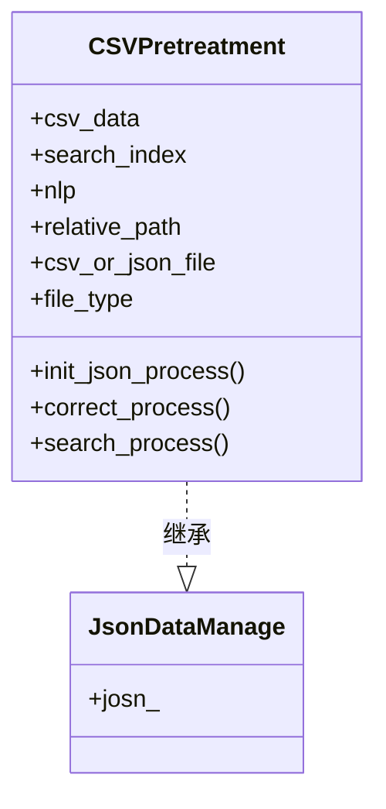

- **author  : Shuxin_Wang**
- **email   : 213202122@seu.edu.cn**
- **time    : 2022/9/7**
- **version: 0.1.0**


# 模块视图



# 预处理JSON文件约定

- `xxx.csv → xxx.json`

```json
{
    "isCompleted": true,
    
    "row": "$行数",
    
    "col": "$列数",
    
    "keyColumnIndex": 0,
    
    "columnsType": ["列类别1", "..."],
    
    "data":[
        //可查询列
        {
            "canSearch": true,
            "type": "$列数据类型",
            "column":[
                {
                    "isNo": false,
                    "value": "$源值",
                    "correction": [
                    "$拼写纠错结果",
                    "..."
                    ],
                    "QIDs":[
                        "$Qxx1",
                        "..."
                    ],
                    "Labels":[
                        "$搜索label1",
                        "..."
                    ],
                    "IRIs":[
                        "$IRI1",
                        "..."
                    ],
                    "Types":[
                        "$DBpedia<Type>1",
                        "..."
                    ]
                },
            ]
        },
        //不可查询列
        {
            "canSearch": false,
            "column":[
                "$源值1", 
                "..."
                ]         
        }, 
    ]
}
```

- `json_data["data"][j]["canSearch"] is True`
  - `csv_data[i][j] → json_data["data"][j]["column"][i]["value"]`

- `json_data["data"][j]["canSearch"] is False`
  - `csv_data[i][j] → json_data["data"][j]["column"`][i]


# 预处理过程


## 初始化设置

- 以每列数据为基本单位；

1. 初步识别每列数据的数据类型，同时筛选可查询实体，即排除数字、日期时间等属性列，并同时找出主题列；
2. 对**可查询列**数据进行拼写纠错；
3. 对纠错完的结果进行`text→IRIs`查询；
4. 保存json文件

